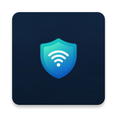
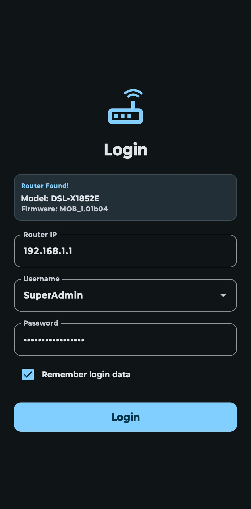
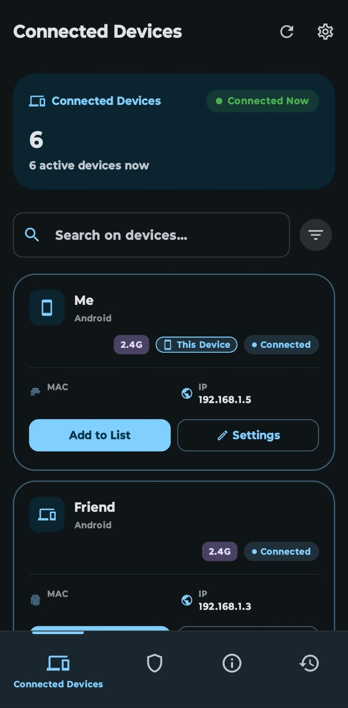
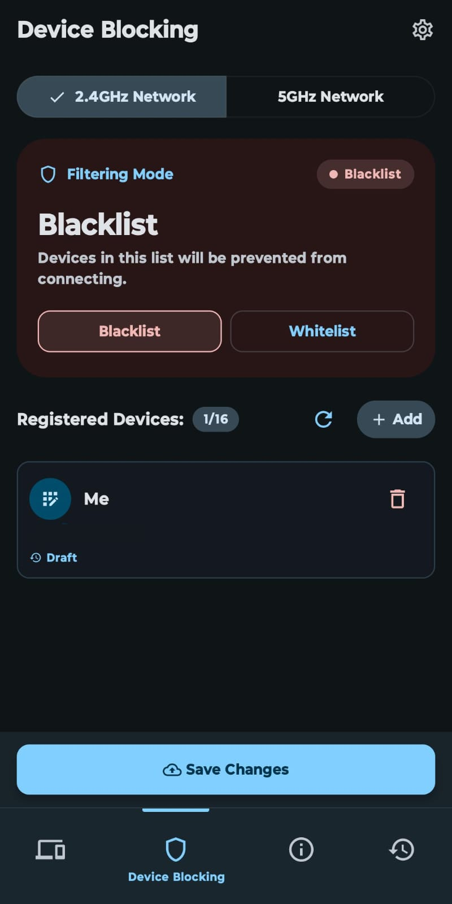
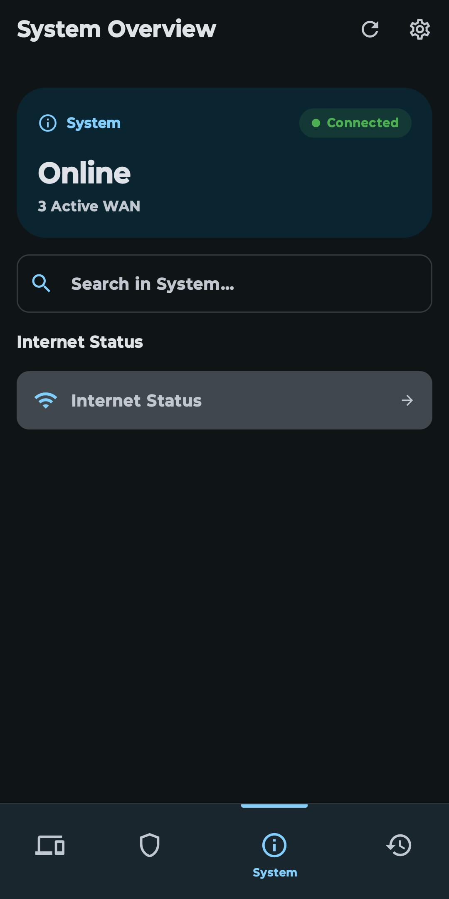
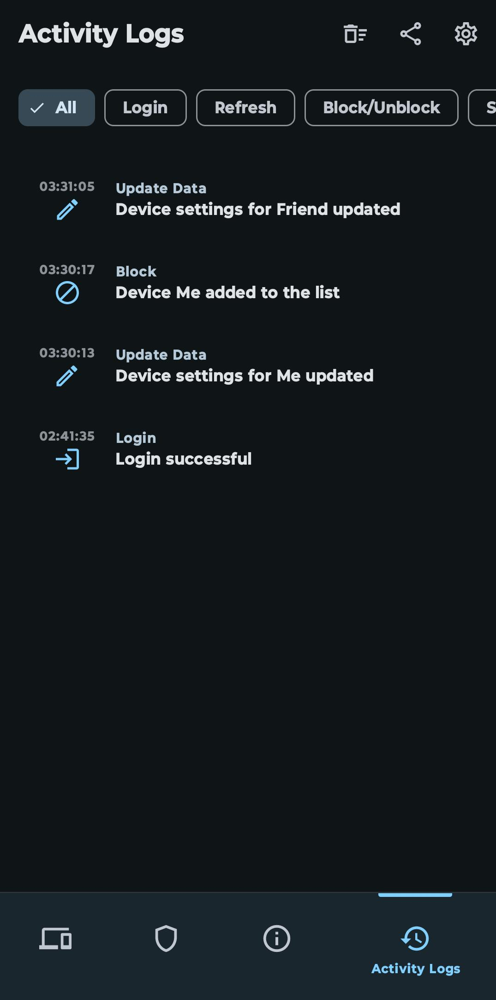
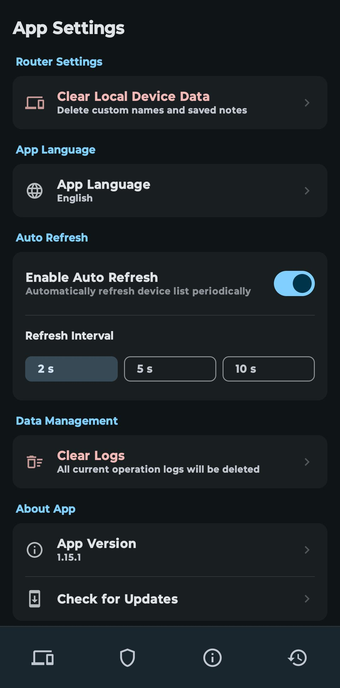

<div align="center">
  

  <h1>D-Link Mobily Management</h1>

  <p>
    
    
    
    
    
  </p>

  <p>
    A modern Android application for monitoring and managing the <strong>D-Link DSL-X1852E</strong> router, with a mobile-first interface designed to simplify router tasks that are typically handled through a legacy web admin panel.
  </p>

  <p>
    <a href="https://github.com/DEVTE544/dsl-x1852e-android-app/releases">Download APK</a> •
    <a href="https://github.com/DEVTE544/dsl-x1852e-android-app/issues">Report Issue</a>
  </p>
</div>

## Overview
D-Link Mobily Management is an Android app focused on improving the day-to-day management experience for supported D-Link router firmware, especially the **DSL-X1852E** variant used by **Mobily**.

The app provides a cleaner mobile interface for device monitoring, Wi-Fi filter management, network diagnostics, and app maintenance tasks such as update checking and local preferences.

## Why?

Many ISP-provided routers use customized firmware and modified web interfaces, which often makes generic router management apps unreliable or completely incompatible.

This project was created to solve that problem for the **D-Link DSL-X1852E**, especially the firmware variant used by **Mobily**, by providing a dedicated Android experience tailored to the actual behavior of the device.

## Key Features

- Real-time monitoring of connected clients across LAN, 2.4GHz Wi-Fi, and 5GHz Wi-Fi
- Device blocking and unblocking through MAC filter management
- Custom device naming and metadata persistence
- WAN and network status monitoring
- Wi-Fi filter management for both 2.4GHz and 5GHz bands
- In-app update checking through GitHub Releases
- Arabic and English localization with manual language switching
- Configurable refresh behavior and app settings
- Logging support for diagnostics and debugging

## Supported Models

These are the firmware versions that are supported or have been successfully tested.

| Model | Firmware / Variant | Status | Notes |
|---|---|---|---|
| DSL-X1852E | MOB_1.01b04 | Supported | Primary tested target |

## Supported Languages

Languages ​​supported by the application; more languages ​​will be added as needed.

| Language | Code | Status | Notes |
|---|---|---|---|
| Arabic | ar | Supported | In-app language switching available |
| English | en | Supported | In-app language switching available |

## Current Scope

At the moment, the project is primarily targeted at the **D-Link DSL-X1852E** router and the firmware variant used by **Mobily**.

Support for other D-Link models or firmware variants should not be assumed unless they are explicitly listed in the **Supported Models** table.

## Core Capabilities

### Router Authentication
The application includes a router login flow based on hashed credentials and cookie/session handling.

### Device Management
You can inspect connected devices, manage block/allow behavior, and maintain local metadata such as custom names and device-related details.

### Wi-Fi Filter Management
The app supports both **Allow** and **Block** modes for Wi-Fi filtering and includes logic to work within the router’s filter slot limitations.

### Network Diagnostics
The app can display WAN-related information such as IP details, gateway, DNS, MAC, and connection state.

### Update Checking
The application includes an update mechanism that checks the latest GitHub Release and compares the remote tag with the app’s local version before offering the latest APK download.

## Tech Stack

- **Language:** Kotlin
- **UI:** Jetpack Compose + Material 3
- **Architecture:** MVVM with Repository pattern
- **Dependency Management Style:** Manual dependency injection via `AppContainer`
- **Networking:** OkHttp, Retrofit, Kotlinx Serialization
- **Persistence:** Jetpack DataStore (Preferences)

## Architecture Notes

The project follows a layered structure that separates UI, state handling, repositories, local storage, and remote communication.

A dedicated parser is used to interact with the router’s legacy interface, while ViewModels expose reactive state to the Compose UI.

## Project Structure

```text
app/src/main/java/com/example/d_linkmobilymanagement/
├── data/         # Local stores, models, network/update logic, repositories
├── ui/           # Compose screens, shared components, navigation, theme
├── viewmodel/    # Presentation logic and state coordination
└── utils/        # App configuration and helper utilities
```

## Getting Started

### Requirements

- Android device running **Android 7.0 (API 24)** or later
- Access to a supported router
- Device connected to the router network when using router-management features

### Install the APK

1. Open the repository Releases page.
2. Download the latest `app-release.apk`.
3. Install the APK on your Android device.
4. Allow installation from unknown sources if your Android version requires it.

## Build From Source

1. Clone the repository:
   ```bash
   git clone https://github.com/DEVTE544/dsl-x1852e-android-app.git
   ```

2. Open the project in Android Studio.

3. Let Gradle sync the project dependencies.

4. Build the project:
   ```bash
   ./gradlew assembleDebug
   ```

## Release and Update Flow

This project uses **GitHub Releases + tags** for app distribution and update detection.

The in-app update checker reads the latest GitHub Release, compares the release tag against the local app version, and offers the latest APK when a newer version is available.

Recommended release asset naming:
- `app-release.apk`

This keeps release downloads predictable and makes the update flow easier to maintain.

## Contributing

Contributions, bug reports, and compatibility findings are welcome.

Please read [CONTRIBUTING.md](./CONTRIBUTING.md) before submitting changes.

For substantial code contributions, the maintainer may require agreement to the project [CLA](./CLA.md).

## Screenshots

<p align="center">
  
  
  
</p>

<p align="center">
  
  
  
</p>


## License

This project is distributed under a custom personal / non-commercial license.

Commercial use requires prior written permission from DEVTE.

See the [LICENSE](./LICENSE) file for details.

## Disclaimer

This is an unofficial management application for supported router models.

Use it carefully and at your own risk, especially when changing router settings, filters, or network-related configuration.

---

Made with love by DEVTE
